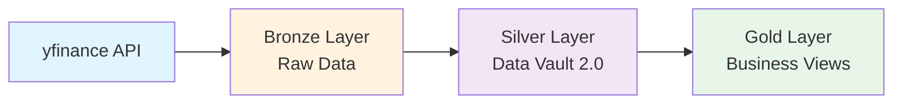
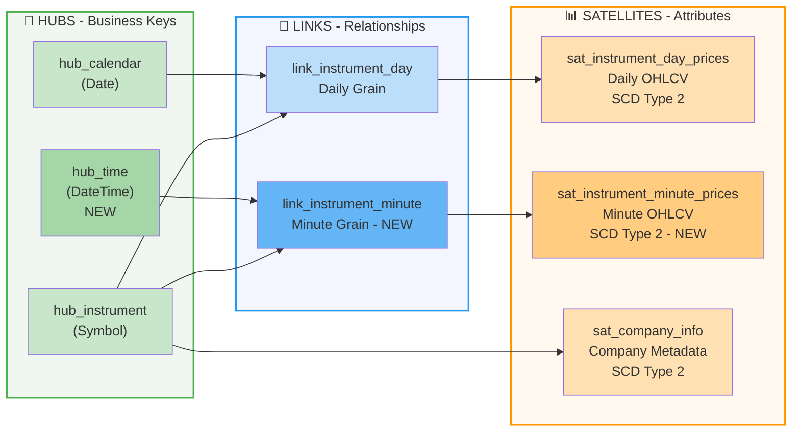
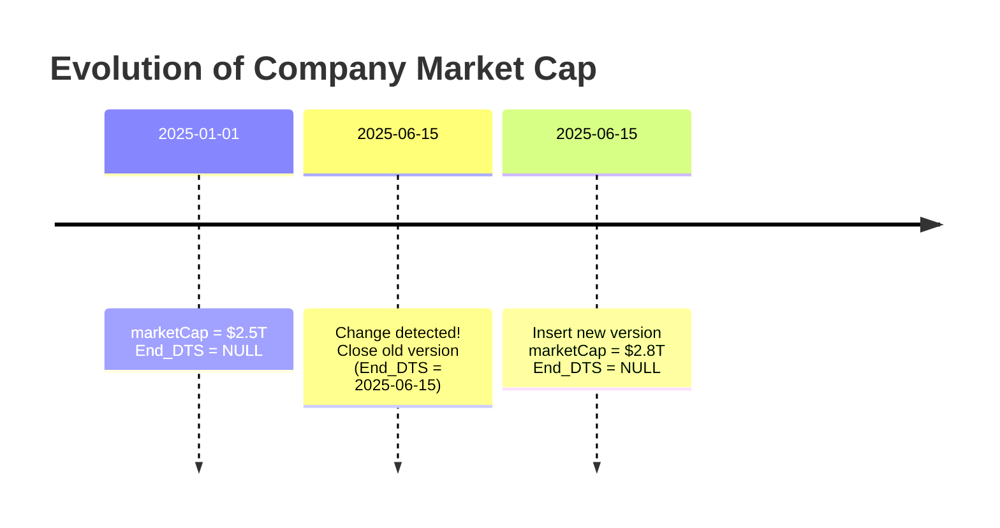
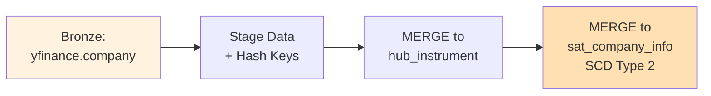
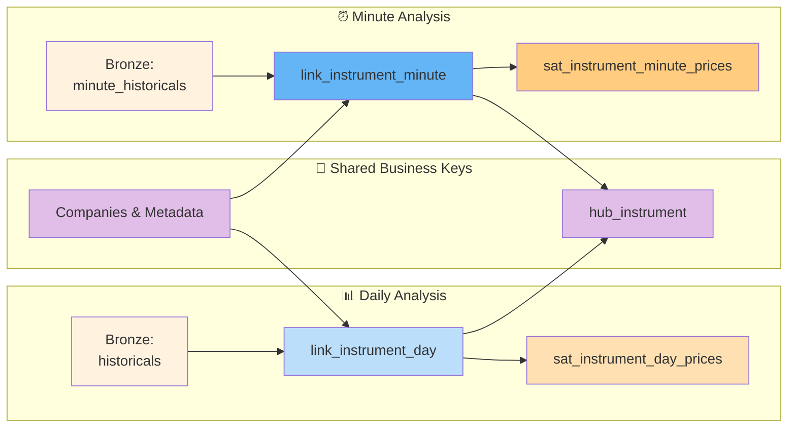

# Safety Knife

A modern data warehouse project using **Data Vault 2.0** and **Slowly Changing Dimensions (SCD Type 2)** patterns with Apache Spark and Delta Lake.

## Architecture Overview

The project follows a **medallion architecture** (Bronze → Silver → Gold) with Data Vault 2.0 modeling principles for the silver layer.



---

## Bronze Layer

The Bronze layer stores **raw, immutable** data from the yfinance API in its original format. Data is available at both daily and minute granularities.

### Bronze Tables

| Table | Purpose | Grain | Frequency |
|-------|---------|-------|----------|
| `yfinance.historicals` | Daily OHLCV prices + dividends/splits | One row per symbol per date | Daily |
| `yfinance.minute_historicals` | Minute-level OHLCV prices | One row per symbol per minute | Intraday |
| `yfinance.company` | Company metadata | One row per symbol | Updated |

---

## Silver Layer: Data Vault 2.0

The Silver layer implements **Data Vault 2.0**, a dimensional modeling approach optimized for:
- ✅ Auditability (complete change history)
- ✅ Flexibility (easy to add new business context)
- ✅ Scalability (hub-and-spoke architecture)
- ✅ Traceability (metadata and lineage)

### Data Vault 2.0 Architecture



### Component Types

#### 🔑 Hubs
Core business entities with immutable business keys:

| Hub | Business Key | Purpose |
|-----|--------------|---------|
| `hub_instrument` | Symbol (MD5 hash) | Track unique securities |
| `hub_calendar` | Date (MD5 hash) | Track trading dates || `hub_time` | DateTime (MD5 hash) | Track timestamps (NEW - supports minute granularity) |
**Columns:**
- `*_HK` - Hash key (MD5 of business key)
- `*` - Business key (Symbol, Date, etc.)
- `Load_DTS` - When record was loaded
- `Record_Source` - Source system

#### 🔗 Links
Relationships between hubs, capturing "what happened when":

| Link | Connects | Purpose | Granularity |
|------|----------|---------|-------------|
| `link_instrument_day` | Hub_Instrument + Hub_Calendar | Track daily prices/company info | Daily |
| `link_instrument_minute` | Hub_Instrument + Hub_Time | Track minute-level prices (NEW) | Minute |

**Columns:**
- `*_LK` - Link key (composite hash)
- `*_HK` - Foreign keys to hubs
- `Load_DTS`, `Record_Source` - Metadata

#### 📊 Satellites
Descriptive attributes with **SCD Type 2** time-versioning:

| Satellite | Parent Link | Attributes | Granularity |
|-----------|-------------|------------|-------------|
| `sat_instrument_day_prices` | link_instrument_day | Open, High, Low, Close, Volume, Dividends, Stock_Splits | Daily |
| `sat_instrument_minute_prices` | link_instrument_minute | Open, High, Low, Close, Volume, Dividends, Stock_Splits (NEW) | Minute |
| `sat_company_info` | hub_instrument | longName, marketCap | Dimension |

---

## SCD Type 2: Tracked History

**SCD Type 2** (Slowly Changing Dimension Type 2) maintains a **complete audit trail** by creating a new row when attributes change.

### How SCD Type 2 Works




### Key Columns

| Column | Purpose |
|--------|---------|
| `Hash_Diff` | MD5 hash of all attributes → detects changes |
| `Effective_DTS` | When this version became active |
| `End_DTS` | When this version ended (NULL = current) |
| `Load_DTS` | When record was loaded |
| `Record_Source` | Source system (e.g., 'yfinance') |

### Example Query: What was the market cap on March 1st?

```sql
SELECT longName, marketCap, Effective_DTS, End_DTS
FROM dv_yfinance.sat_company_info
WHERE Instrument_HK = 'abc123'
  AND Effective_DTS <= '2025-03-01'
  AND (End_DTS IS NULL OR End_DTS > '2025-03-01')
ORDER BY Effective_DTS;
```

### MERGE Pattern (Delta Lake)

```sql
MERGE INTO dv_yfinance.sat_company_info t
USING company_staged s
ON t.Instrument_HK = s.Instrument_HK AND t.End_DTS IS NULL
WHEN MATCHED AND t.Hash_Diff != s.Hash_Diff THEN 
    UPDATE SET End_DTS = CURRENT_TIMESTAMP()  -- Close old version
WHEN NOT MATCHED THEN 
    INSERT (...) VALUES (...)                 -- Insert new version
```

---

## Data Flow: Bronze → Silver



**For each load cycle:**
1. **Stage** data from bronze layer with hash keys
2. **MERGE to Hub** - Idempotent insert of business keys
3. **MERGE to Satellite** - SCD Type 2 logic:
   - Detect changes via `Hash_Diff`
   - Close old versions (set `End_DTS`)
   - Insert new versions (set `End_DTS = NULL`)

---

## Dual Granularity: Daily & Minute Data

The warehouse supports both **daily** and **minute-level** analysis through a shared hub-and-spoke model:



### Granularity Comparison

| Aspect | Daily | Minute |
|--------|-------|--------|
| **Data Points per Symbol per Day** | 1 | ~390 (6.5 hrs × 60 min) |
| **Bronze Table** | `historicals` | `minute_historicals` |
| **Hub (Time)** | `hub_calendar` (date grain) | `hub_time` (datetime grain) |
| **Link Table** | `link_instrument_day` | `link_instrument_minute` |
| **Satellite** | `sat_instrument_day_prices` | `sat_instrument_minute_prices` |
| **Primary Use** | EOD reports, aggregations | Intraday analysis, high-freq trading |
| **SCD Type 2** | ✅ Yes | ✅ Yes |

### Query Example: Analyze intraday volatility

```sql
SELECT 
    t.DateTime,
    i.Symbol,
    p.Open,
    p.Close,
    p.High - p.Low AS Intraday_Range
FROM dv_yfinance.link_instrument_minute lim
JOIN dv_yfinance.sat_instrument_minute_prices p 
    ON lim.Instrument_Minute_LK = p.Instrument_Minute_LK AND p.End_DTS IS NULL
JOIN dv_yfinance.hub_time t ON lim.Time_HK = t.Time_HK
JOIN dv_yfinance.hub_instrument i ON lim.Instrument_HK = i.Instrument_HK
WHERE DATE(t.DateTime) = CURRENT_DATE
ORDER BY t.DateTime;
```

---

## Project Structure

```
safety-knife/
├── src/safety_knife/
│   ├── bronze/
│   │   ├── fetch_data.py         # Retrieve from yfinance
│   │   ├── store_data.py         # Save to Delta Lake
│   │   ├── wrangle_data.py       # Transform/clean
│   │   └── drive_data.py         # Orchestrate bronze ETL
│   ├── silver/
│   │   ├── load_data sql.py      # Data Vault MERGE logic
│   │   └── ddl/
│   │       └── table_migration.py # Create DV tables
│   ├── spark_utils.py            # Spark session factory
│   └── config.py                 # Configuration
├── data/
│   ├── bronze/                   # Raw data
│   └── silver/                   # Data Vault tables
└── README.md
```

---

## Running the Project

### 1. Create Silver Layer Tables
Creates all hub, link, and satellite tables for both daily and minute granularities:
```bash
poetry run python src/safety_knife/silver/ddl/table_migration.py
```

Tables created:
- Daily: `hub_instrument`, `hub_calendar`, `link_instrument_day`, `sat_instrument_day_prices`, `sat_company_info`
- Minute: `hub_time`, `link_instrument_minute`, `sat_instrument_minute_prices` (NEW)

### 2. Load Bronze Data
Fetches and stores raw data (daily + minute-level) from yfinance API:
```bash
poetry run python src/safety_knife/bronze/drive_data.py
```

### 3. Load Silver Layer (Data Vault)
Executes all MERGE statements to load hubs, links, and satellites for both granularities:
```bash
poetry run python src/safety_knife/silver/load_data\ sql.py
```

This script:
- **Daily**: Loads `hub_calendar`, `link_instrument_day`, `sat_instrument_day_prices`
- **Minute**: Loads `hub_time`, `link_instrument_minute`, `sat_instrument_minute_prices` (NEW)
- **Company**: Loads `sat_company_info` with SCD Type 2 history

---

## Why Data Vault 2.0?

| Aspect | Traditional Star Schema | Data Vault 2.0 |
|--------|------------------------|----------------|
| **Business Key Changes** | Requires redesign | Easily extensible |
| **Change History** | Lost/expensive | Built-in (SCD Type 2) |
| **Multiple Sources** | Difficult to track | Explicit Record_Source |
| **Auditability** | Limited | Complete lineage |
| **Scalability** | Can degrade | Predictable hub-spoke |

---

## Technologies

- **Apache Spark 4.1** - Distributed processing
- **Delta Lake 4.1** - ACID transactions, time travel, schema enforcement
- **Python 3.14** - ETL scripting
- **Poetry** - Dependency management

---

## References

- [Data Vault 2.0 by Dan Linstedt](https://www.linkedin.com/in/1ldt/)
- [Delta Lake Merge Documentation](https://docs.delta.io/latest/delta-update.html)
- [SCD Types Explanation](https://en.wikipedia.org/wiki/Slowly_changing_dimension)
